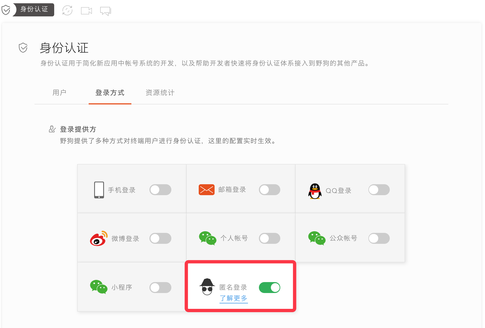

# video-demo-web

`video-demo-web` 是基于`wilddog-video-call SDK`,`wilddog-video-room SDK`,`wilddog SDK`开发的视频通话Demo，其中图片存储也使用了七牛的js sdk

## 准备环境

### 创建wilddog应用

在控制面板中创建野狗应用。


配置应用

在 `身份认证` 标签页中，选择 `登录方式` 标签，开启 `匿名登录` 功能, 也可以选择其他的登录方式



在 `实时视频通话` 标签页中，点击 `开启视频通话` 按钮。


获取`VideoAppID`

## 开始项目

``` bash
# 安装依赖
npm install

# 启动服务，在浏览器的地址栏里输入https://127.0.0.1:3060
npm run dev

# 打包上线
npm run build
